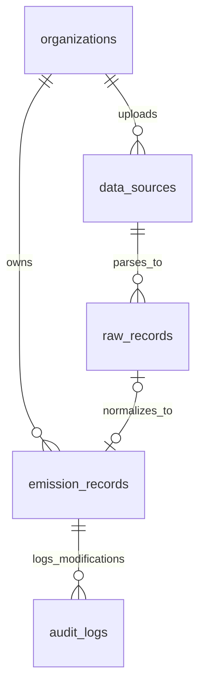

# Data Model & Schema Design

This document details the database schema design, multi-tenancy strategy, data normalization layer, and audit trailing implemented in the ESG Ingestion Platform.

---

## Entity-Relationship Diagram

---

## Model Schemas

### 1. `Organization`
Represents the tenant entity. In an enterprise context, all data is partitioned by this entity to enforce strict access controls.

| Field | Type | Attributes | Description |
|---|---|---|---|
| `id` | UUID | PK, Auto-generated | Globally unique identifier for the tenant. |
| `name` | VarChar(255) | Required | Client organization name (e.g. "Acme Corp"). |
| `created_at` | DateTime | Auto-now-add | Timestamp when the tenant was onboarded. |

### 2. `DataSource`
Tracks uploaded files. Preserving files provides an audit path showing where raw inputs originated.

| Field | Type | Attributes | Description |
|---|---|---|---|
| `id` | UUID | PK, Auto-generated | Identifier for the upload batch. |
| `organization` | ForeignKey | `Organization`, CASCADE | Links file to the tenant owner. |
| `source_type` | VarChar(50) | Choices: `SAP`, `UTILITY`, `TRAVEL` | Specifies parsing parser mapping. |
| `uploaded_file` | FileField | Local/S3 storage | Pointer to the raw `.csv` file. |
| `uploaded_by` | VarChar(255) | Default: `system_user` | Email of the analyst who uploaded the file. |
| `uploaded_at` | DateTime | Auto-now-add | Timestamp when file upload completed. |
| `ingestion_status`| VarChar(50) | Choices: `PENDING`, `PROCESSING`, `SUCCESS`, `FAILED` | State machine tracking file execution. |
| `error_message` | TextField | Nullable | Overall file parsing errors (e.g., malformed columns). |

### 3. `RawRecord`
Stores the original, unprocessed records in an immutable form.

> [!IMPORTANT]
> **Source-of-Truth Preservation:**
> Keeping raw data separate from clean data allows auditor verification of calculation fidelity and lets us re-run updated normalization algorithms retrospectively without losing historical entry states.

| Field | Type | Attributes | Description |
|---|---|---|---|
| `id` | UUID | PK, Auto-generated | Identifier for the row. |
| `datasource` | ForeignKey | `DataSource`, CASCADE | Parent upload file context. |
| `raw_json` | JSONField | Required | Key-value dictionary representing the raw CSV row. |
| `processing_status`| VarChar(50) | Choices: `UNPROCESSED`, `SUCCESS`, `SUSPICIOUS`, `FAILED` | Normalization state for this individual row. |
| `error_message` | TextField | Nullable | Row-level validation messages. |
| `created_at` | DateTime | Auto-now-add | Timestamp of ingestion creation. |

### 4. `EmissionRecord`
Contains normalized, queryable activity data and calculated greenhouse gas emissions (in Metric Tons of CO2e).

| Field | Type | Attributes | Description |
|---|---|---|---|
| `id` | UUID | PK, Auto-generated | Unique record identifier. |
| `organization` | ForeignKey | `Organization`, CASCADE | Fast tenant queries partition index. |
| `raw_record` | ForeignKey | `RawRecord`, SET_NULL, Nullable | Backlink to the immutable raw data. |
| `scope_category` | VarChar(50) | Choices: `Scope1`, `Scope2`, `Scope3` | Greenhouse Gas Protocol classification. |
| `activity_type` | VarChar(100) | Required | Normalized activity group. |
| `quantity` | Decimal(18,4) | Required | Original raw quantity value. |
| `unit` | VarChar(50) | Required | Original raw unit label. |
| `normalized_quantity`| Decimal(18,4)| Required | Converted quantity. |
| `normalized_unit` | VarChar(50) | Required | Standardized unit (`L` for fuels, `kWh` for electricity, `kg CO2e eq` for travel). |
| `emission_factor` | Decimal(12,6) | Required | kg CO2e multiplier. |
| `calculated_emission`| Decimal(18,6)| Required | Calculated greenhouse gases in Metric Tons CO2e (`tCO2e`). |
| `suspicious_flag` | Boolean | Default: `False` | True if marked by validation engine. |
| `suspicious_reason`| TextField | Nullable | Concatenated validation violation description. |
| `approval_status` | VarChar(50) | Choices: `PENDING`, `APPROVED`, `REJECTED` | Review workflow stage. |
| `locked_for_audit` | Boolean | Default: `False` | Set to True on approval. Locks record from editing. |
| `activity_date` | Date | Nullable, Indexed | The representative business/posting/billing-end date of the emissions activity. |
| `billing_period_start`| Date | Nullable | Start of the utility billing cycle (Utility only). |
| `billing_period_end`  | Date | Nullable | End of the utility billing cycle (Utility only). |
| `created_at` | DateTime | Auto-now-add | Creation date. |
| `updated_at` | DateTime | Auto-now | Update date. |

### 5. `AuditLog`
Holds the immutable audit trail for modifications made to emission records.

| Field | Type | Attributes | Description |
|---|---|---|---|
| `id` | UUID | PK, Auto-generated | Log identifier. |
| `emission_record` | ForeignKey | `EmissionRecord`, CASCADE | Link to the edited record. |
| `changed_by` | VarChar(255) | Default: `anonymous_analyst` | Username/email of person committing the edit. |
| `old_value` | JSONField | Required | Serialized state before the modification. |
| `new_value` | JSONField | Required | Serialized state after the modification. |
| `change_reason` | TextField | Required | Mandatory analyst explanation. |
| `timestamp` | DateTime | Auto-now-add | Time of change. |

---

## Key Engineering Designs

### Multi-Tenancy Strategy
Strict separation of tenant organizations is achieved by:
1. Every major table containing an `organization` foreign key.
2. The REST API resolving the active tenant at the controller layer via a request header (`X-Organization-ID`).
3. Viewsets intercepting queries and filtering by the resolved tenant organization.

### Audit Trail Implementation
Whenever an analyst edits an `EmissionRecord`:
- The request passes a mandatory `change_reason` parameter.
- The view captures the state *before* save and *after* save.
- A difference (delta) comparison is tracked, and saved as a new row in `AuditLog`.
- On approval, the record is locked (`locked_for_audit = True`). In addition to serializer-level API checks, this lock is enforced strictly at the database/model level by overriding the `save()` and `delete()` methods on `EmissionRecord`. Any attempt to edit or delete a locked record via ORM queries, Django admin, or the shell raises a `ValidationError` to guarantee immutability.
